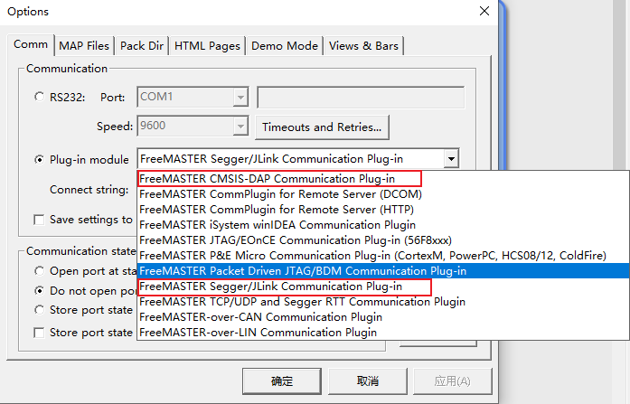
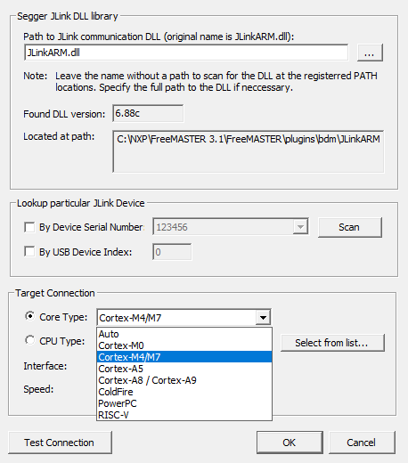
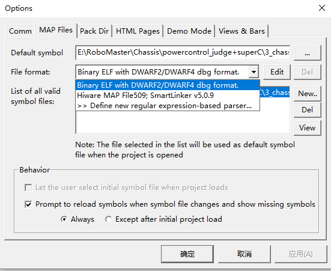
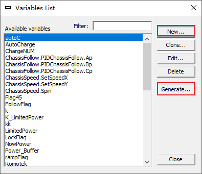
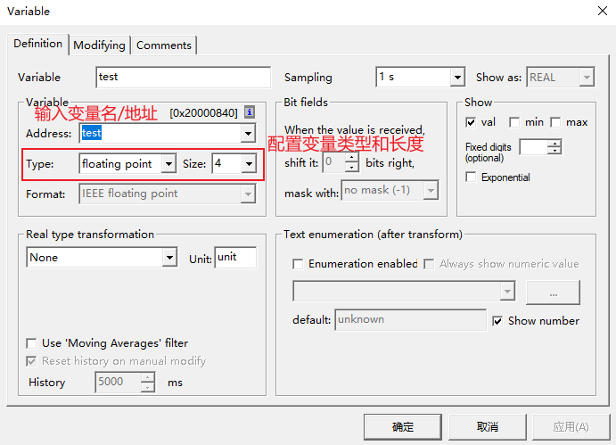
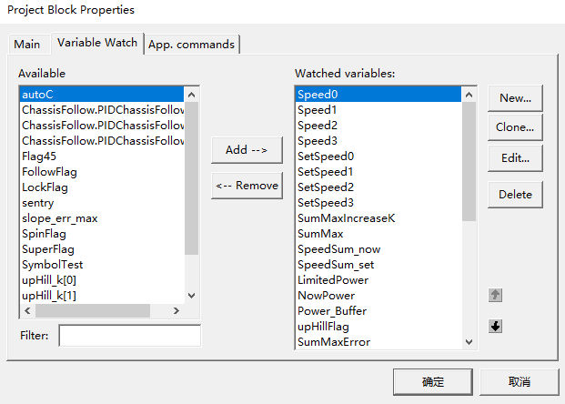
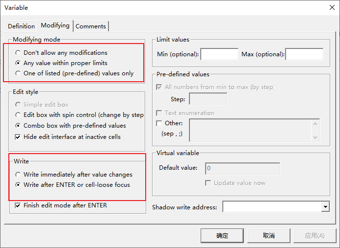
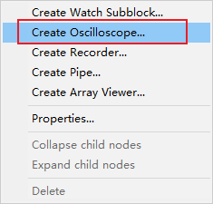
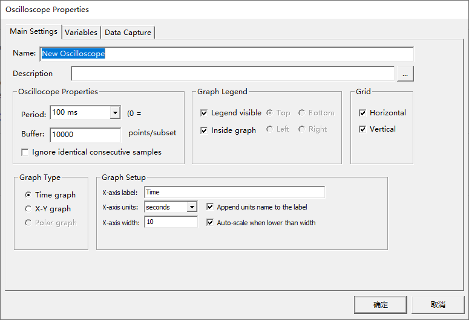

## 项目配置

### 调试器

选Project下的Option，在Common选卡里面选Plug-in Module，下拉列表里面按需选调试器类型。正点原子的无线调试器是CMSIS DAP，Jlink OB就选Jlink。选完后点Configure，按左下角的Test Connection检查调试器是否正常连接。

Jlink的话在Configure窗口里选Core Type为Cortex-M4（STM32F4就是用Cortex-M4的）再Test Connection即可

### MAP Files

配置完调试器后，在Option窗口里面选MAP Files选项，Default symbol选Keil生成的axf文件的路径，File format选ELF。可以点下面的View检查是否读取到变量的地址

### 添加变量

在Option窗口里面选Variables选项

点New,在弹出来的窗口里的Address里直接输入你想查看的变量名，如果地址非空则说明识别成功，同时配置变量类型和长度。变量显示的名称可以在Variable里面改。点击确定

点Generate,在弹出的列表里选择你想要的变量，点Generate Single Variable，或者点Generate array for symbol生成连续数组元素，或者点Generate all structure members生成结构体所有属性

## Watch

在主界面的watch窗口里面右键选Watch Properties

在弹出的窗口里选Watch选卡，选中想要监视的变量，点Add即可添加到监视窗口。

默认情况下FreeMASTER不允许我们修改变量，选择右侧的Edit，在弹出的窗口里选Modifying选卡，将选项改为如图所示，确定之后我们就可以在Watch窗口里修改这个变量了

## 图形化窗口

在左侧Project一栏里右键，选Create Oscilloscope

Period是采样周期，一般用有线连接的Jlink可以尽可能设到0（尽可能快地采集），但是对于无线调试器而言，2-3个变量10ms是极限，更多变量要用20ms的采样时间，否则容易出现卡死的情况。Buffer是指一次缓存的点的最多数量，可以调大一些。

