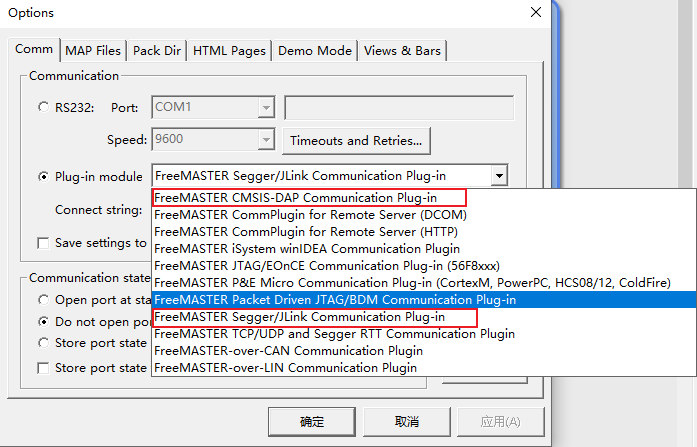
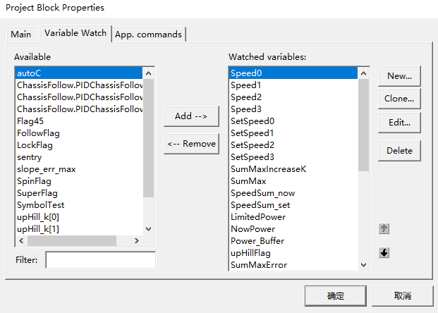
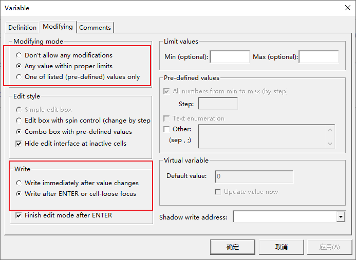

# 安装软件

## 安装Arm GNU Toolchain

[Arm GNU Toolchain Downloads – Arm Developer](https://developer.arm.com/downloads/-/arm-gnu-toolchain-downloads)

打开下载网站，下载对应平台的 arm-none-eabi 软件，选择可执行文件和压缩文件都可以。

1. exe安装
2. zip安装

exe安装可以在安装时勾选把软件添加到环境变量。


zip安装需要自行解压软件后，自己配置环境变量。

## 安装OpenOCD

[Download OpenOCD for Windows (gnutoolchains.com)](https://gnutoolchains.com/arm-eabi/openocd/)

这里下载最新版直接解压就可以，在这套工具链中不用配置环境变量也可以使用。

OpenOCD 对 jlink 的适配不是很好 需要借助 UsbDriverTool 将 jlink 改为 winusb 模式

[Automatic USB driver installer for FTDI and LibUSB drivers (visualgdb.com)](https://visualgdb.com/UsbDriverTool/)


## 安装FreeMASTER

[FreeMASTER运行时调试工具_NXP 半导体](https://www.nxp.com.cn/design/software/development-software/freemaster-run-time-debugging-tool:FREEMASTER)

安装软件要注意两点

1. 选择安装组件项目时选择第一个 FreeMASTER desktop application 即可。


2. 安装路径选择默认，否则使用会出现找不到插件的问题。


对应分辨率较高的屏幕，软件显示可能会出现一些不适配。需要在安装完成后设置缩放为系统（增强）

打开FreeMASTER，右键任务栏图标，右键NXP FreeMASTER main executable，单击属性。在兼容性选项卡-设置-更改高DPI设置


## 安装CubeMX

[STM32CubeMX - STM32Cube初始化代码生成器 - STMicroelectronics](https://www.st.com/zh/development-tools/stm32cubemx.html)

安装一路next即可。

## 安装Clion IDE

[CLion: A Cross-Platform IDE for C and C++ by JetBrains](https://www.jetbrains.com/clion/)

这是一个非常好用的 IDE 并且学生可以申请免费试用 [免费教育许可证 - 社区支持 (jetbrains.com)](https://www.jetbrains.com/zh-cn/community/education/#students)

安装一路next即可。

# 使用流程


1. CubeMX用于代码生成，可以通过图形化的方式配置好基本的的外设功能。

2. Clion用于代码的编写、编译和将二进制文件烧录到单片机。也可以实现一些debug功能。

3. FreeMASTER 用于在线调试，可视化变量，在线修改变量。

# CubeMX 使用方法

生成代码时Project Manager  Toolchain/IDE 选择 STM32CubeIDE

# Clion 配置

设置OpenOCD 位置即可使用。


使用jlink

```openocd
#source [find interface/cmsis-dap.cfg]
source [find interface/jlink.cfg]
#interface cmsis-dap
transport select swd
adapter speed 50000
#cmsis_dap_backend hid
#adapter_khz 100
source [find target/stm32f4x.cfg]
```

使用daplink
```openocd
source [find interface/cmsis-dap.cfg]
#interface cmsis-dap
transport select swd
adapter speed 50000
#cmsis_dap_backend hid
#adapter_khz 100
source [find target/stm32f4x.cfg]
```

使用无线调试器
```openocd
source [find interface/cmsis-dap.cfg]
#interface cmsis-dap
transport select swd
adapter speed 50000
cmsis_dap_backend hid
#adapter_khz 100
source [find target/stm32f4x.cfg]
```

使用clion debug 时可能会报错

修复方法

```c
  /* USER CODE BEGIN 1 */
  //修复openocd初始化时钟问题
    __HAL_RCC_HSI_ENABLE();
    __HAL_RCC_SYSCLK_CONFIG(RCC_SYSCLKSOURCE_HSI);
  /* USER CODE END 1 */
```


# FreeMASTER 使用方法

## 项目配置

### 调试器

选Project下的Option，在Common选卡里面选Plug-in Module，下拉列表里面按需选调试器类型。正点原子的无线调试器是CMSIS DAP，Jlink OB就选Jlink。选完后点Configure，按左下角的Test Connection检查调试器是否正常连接。



Jlink的话在Configure窗口里选Core Type为Cortex-M4（STM32F4就是用Cortex-M4的）再Test Connection即可


### MAP Files

配置完调试器后，在Option窗口里面选MAP Files选项，Default symbol选Keil生成的axf文件的路径，File format选ELF。可以点下面的View检查是否读取到变量的地址


### 添加变量

在Option窗口里面选Variables选项


点New,在弹出来的窗口里的Address里直接输入你想查看的变量名，如果地址非空则说明识别成功，同时配置变量类型和长度。变量显示的名称可以在Variable里面改。点击确定


点Generate,在弹出的列表里选择你想要的变量，点Generate Single Variable，或者点Generate array for symbol生成连续数组元素，或者点Generate all structure members生成结构体所有属性


## Watch

在主界面的watch窗口里面右键选Watch Properties

在弹出的窗口里选Watch选卡，选中想要监视的变量，点Add即可添加到监视窗口。



默认情况下FreeMASTER不允许我们修改变量，选择右侧的Edit，在弹出的窗口里选Modifying选卡，将选项改为如图所示，确定之后我们就可以在Watch窗口里修改这个变量了



## 图形化窗口

在左侧Project一栏里右键，选Create Oscilloscope


Period是采样周期，一般用有线连接的Jlink可以尽可能设到0（尽可能快地采集），但是对于无线调试器而言，2-3个变量10ms是极限，更多变量要用20ms的采样时间，否则容易出现卡死的情况。Buffer是指一次缓存的点的最多数量，可以调大一些。


