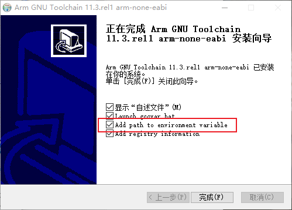
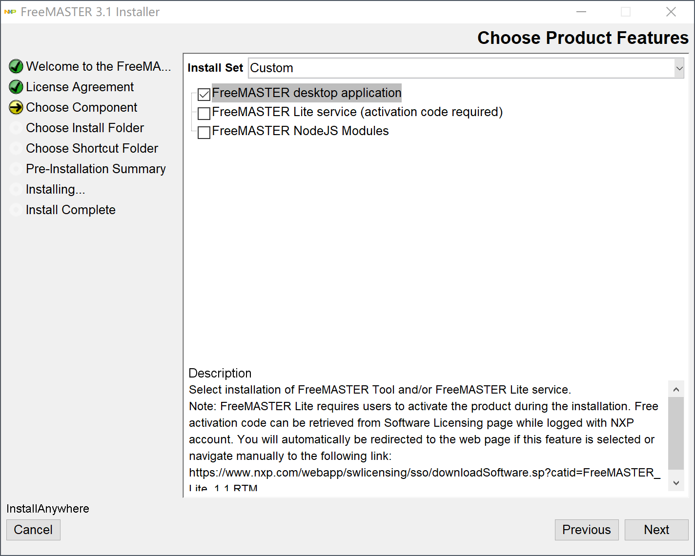
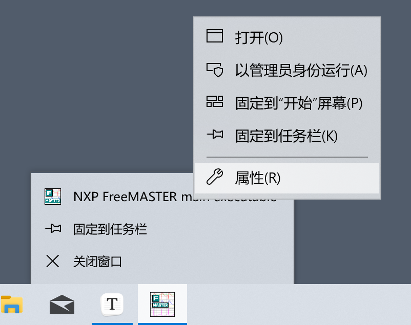
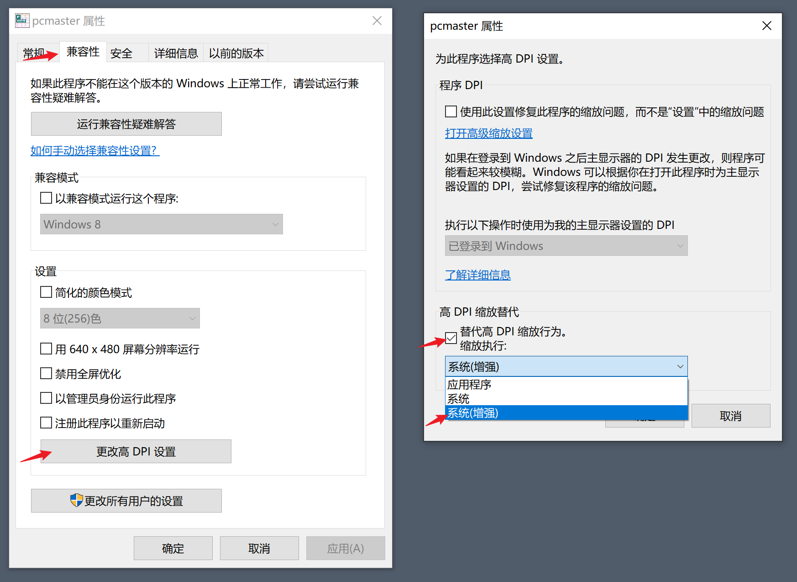
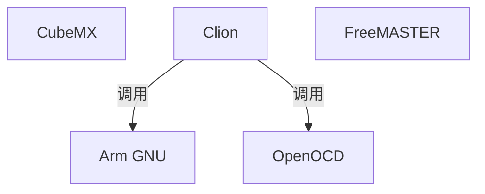
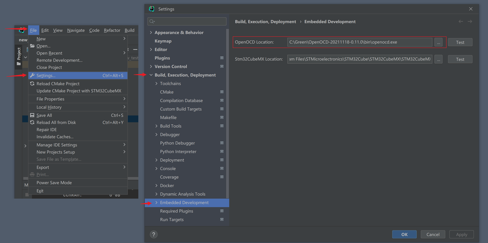

# 安装软件

## 安装Arm GNU Toolchain

[Arm GNU Toolchain Downloads – Arm Developer](https://developer.arm.com/downloads/-/arm-gnu-toolchain-downloads)

打开下载网站，下载对应平台的 arm-none-eabi 软件，选择可执行文件和压缩文件都可以。

1. exe安装
2. zip安装

exe安装可以在安装时勾选把软件添加到环境变量。



zip安装需要自行解压软件后，自己配置环境变量。

## 安装OpenOCD

[Download OpenOCD for Windows (gnutoolchains.com)](https://gnutoolchains.com/arm-eabi/openocd/)

这里下载最新版直接解压就可以，在这套工具链中不用配置环境变量也可以使用。

OpenOCD 对 jlink 的适配不是很好 需要借助 UsbDriverTool 将 jlink 改为 winusb 模式

[Automatic USB driver installer for FTDI and LibUSB drivers (visualgdb.com)](https://visualgdb.com/UsbDriverTool/)

注意安装路径不要包含空格


## 安装FreeMASTER

[FreeMASTER运行时调试工具_NXP 半导体](https://www.nxp.com.cn/design/software/development-software/freemaster-run-time-debugging-tool:FREEMASTER)

安装软件要注意两点

1. 选择安装组件项目时选择第一个 FreeMASTER desktop application 即可。



2. 安装路径选择默认，否则使用会出现找不到插件的问题。


对应分辨率较高的屏幕，软件显示可能会出现一些不适配。需要在安装完成后设置缩放为系统（增强）

打开FreeMASTER，右键任务栏图标，右键NXP FreeMASTER main executable，单击属性。在兼容性选项卡-设置-更改高DPI设置





## 安装CubeMX

[STM32CubeMX - STM32Cube初始化代码生成器 - STMicroelectronics](https://www.st.com/zh/development-tools/stm32cubemx.html)

安装一路next即可。

## 安装Clion IDE

[CLion: A Cross-Platform IDE for C and C++ by JetBrains](https://www.jetbrains.com/clion/)

这是一个非常好用的 IDE 并且学生可以申请免费试用 [免费教育许可证 - 社区支持 (jetbrains.com)](https://www.jetbrains.com/zh-cn/community/education/#students)

安装一路next即可。

# 使用流程



1. CubeMX用于代码生成，可以通过图形化的方式配置好基本的的外设功能。

2. Clion用于代码的编写、编译和将二进制文件烧录到单片机。也可以实现一些debug功能。

3. FreeMASTER 用于在线调试，可视化变量，在线修改变量。

# CubeMX 使用方法

生成代码时Project Manager  Toolchain/IDE 选择 STM32CubeIDE

# Clion 配置

设置OpenOCD 位置即可使用。



使用jlink

```openocd
source [find interface/jlink.cfg]
transport select swd
adapter speed 50000
source [find target/stm32f4x.cfg]
```

使用daplink和无线调试器
```openocd
source [find interface/cmsis-dap.cfg]
transport select swd
adapter speed 50000
source [find target/stm32f4x.cfg]
```

如果无线调试器无法识别
```openocd
source [find interface/cmsis-dap.cfg]
transport select swd
adapter speed 50000
cmsis_dap_backend hid
source [find target/stm32f4x.cfg]
```

使用clion debug 时可能出问题，原因时openocd在下载时会配置时钟，与HAL 库发生了冲突，卡在了初始化中。

## 修复方法
在 main.c 中加入下面的代码

```c
  /* USER CODE BEGIN 1 */
  //修复openocd初始化时钟问题
    __HAL_RCC_HSI_ENABLE();
    __HAL_RCC_SYSCLK_CONFIG(RCC_SYSCLKSOURCE_HSI);
  /* USER CODE END 1 */
```


# FreeMASTER 使用方法

[使用方法](./FreeMASTER.md)